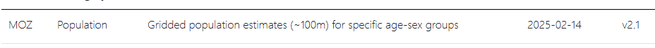
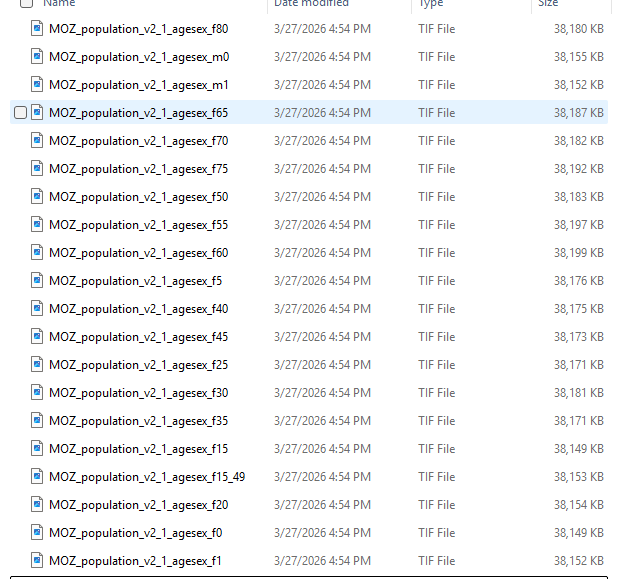
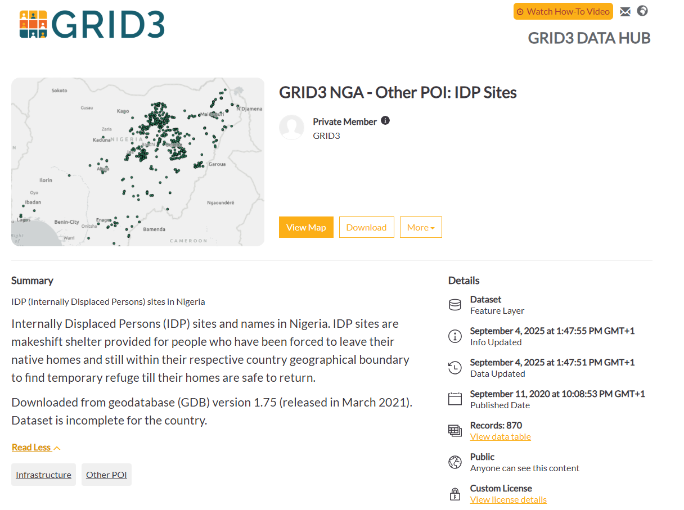
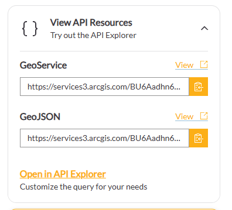
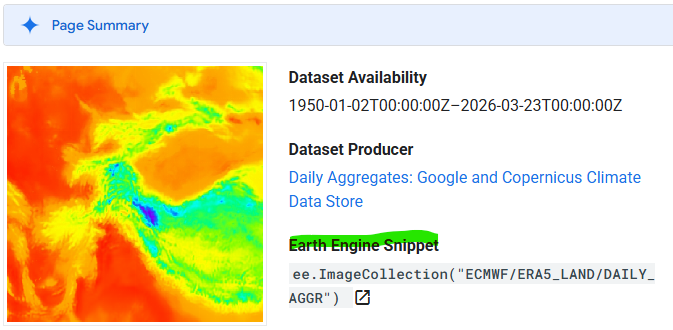
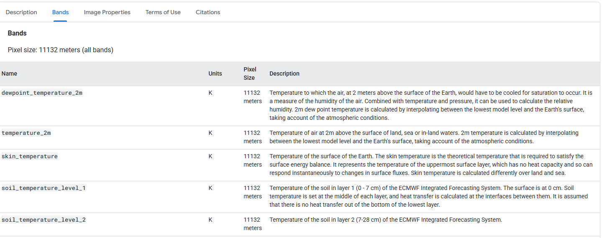
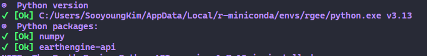

**This Quarto document is written for the trainees of Data Use for Decision Science curriculum organized by Resolve to Save Lives (RTSL).**

# Objectives

-   Understand the basic concepts of API and JSON
-   Retrieve and use open-source data for your data use projects with R

# Required packages

```{r}
#| eval: false
#| label: pre-requisite

# install pacman before executing this code
install.packages('pacman')

# I also used the remotes to install directly from github
remotes::install_github('r-spatial/rgee')
```

```{r}
#| label: required_packages

pacman::p_load(
  # helper packages
  here,
  rio,
  
  # basic packages for data manipulation
  ggplot2,      # The gold standard system for creating declarative and layered data visualizations.
  dplyr,        # A grammar for fast and intuitive data manipulation and transformation.
  tidyverse,    # An opinionated collection of R packages designed for cohesive data science workflows.
  magrittr,     # Provides the pipe operator (%>%) to make code more readable and functional.
  stringr,      # String manipulation package.
  
  # packages to make API calls, read json, convert json to data frame
  httr,         # Tools for working with HTTP requests to pull data from web APIs.
  jsonlite,     # A robust parser for converting JSON data into R objects and data frames.
  geojson,      # Tools for processing and validating GeoJSON data structures.
  geojsonsf,    # Quickly converts GeoJSON strings or files into simple-feature (sf) objects.
  rvest,        # Specifically designed to scrape and harvest data from HTML web pages.
 
  # packages for raster data handling
  raster,       # Essential for reading, writing, and manipulating gridded geographic data.
  terra,        # The high-performance successor to 'raster' for handling massive gridded datasets.
  exactextractr, # Rapidly summarizes raster values (like rainfall) within vector zones (like districts).
  spdep,        # Essential for spatial econometrics and calculating spatial weights and autocorrelation.

  
  # visualization packages for maps
  leaflet,      # Creates interactive, mobile-friendly web maps for exploration and dashboards.
  sp,           # A legacy framework for defining and managing spatial data structures in R.
  tmap,         # A flexible system for creating both static and interactive thematic maps.
  sf,           # The modern standard for handling "simple features" (vector) spatial data.
  scales,       # Automatically determines breaks and labels for axes and map legends.
  
  # Some additional packages I used for GEE
  reticulate,   # R-python interface 
  rgee,         # R-GEE interface
  caret, 
  geojsonio,
  
  # Open Street Map pacakge
  osrm
)

```

# Example 1. Worldpop

This code uses the downloaded geotiff data from WorldPop and calculates the population estimate for polygons in a given shapefile. Here, we're not using API calls. This approach is suitable when the data is not dynamic (meaning it only gets updated once every year or a longer interval.

-   Geotiff data can be searched and downloaded directly from [WorldPop Data Catalog](https://www.worldpop.org/datacatalog/)
-   For more reliable population estimates (availability varies by country), use [WorldPop Open Population Data Repository](https://wopr.worldpop.org/)
-   Pre-requisite: shapefile with polygons for which you'd like to extract the population estimates for

## Mozambique population estimates (\~100m) for specific age-sex group

I downloaded this set of geotiff data from [here](https://wopr.worldpop.org/?MOZ/).



When you extract the zip file, you will see there are separate geotiff images for each age-sex group.



For this example, we will try to extract the \# of women in their reproductive age (15-49 years).

```{r}
#| label: moz_pop_est_example

# Load Mozambique shapefile with ADM3 level boundaries

moz_shp <- read_sf(dsn = here::here("data", "MOZ_shapefile",
                                    "moz_admin3.shp"))
# Inspect the loaded shapefile  

names(moz_shp)
plot(moz_shp)

# check the CRS - you'll see it's WGS 84

crs(moz_shp) 

# Load the geotiff data for women in reproductive age (100m res)

pop_reprod <- raster(here::here("data", "MOZ_pop_agesex",
                                "MOZ_population_v2_1_agesex_f15_49.tif"))

# (Optional)  aggregate by factor of 10 to make it a 1km resolution. This takes time but it will accelerate the subsequent steps to be faster.

pop_reprod2 <- aggregate(pop_reprod, fact=10, fun=sum)

# Calculate the population estimate per ADM3 level
## Use this line if you want to use the 1km resolution geotiff (this might save some time)
total_pop_reprod <- terra::extract(pop_reprod2, moz_shp, fun=sum, na.rm=T)
## Use this line if you want to use the original 100m resolution geotiff (this might take a lot of time)
#total_pop_reprod <- terra::extract(pop_reprod, moz_shp, fun=sum, na.rm=T)

# Merge the population estimate per ADM3 with the shapefile
moz_shp %<>% cbind(total_pop_reprod)
head(moz_shp %>% 
       dplyr::select(adm1_name, 
                     adm2_name, 
                     adm3_name, 
                     total_pop_reprod), 
     n=5)


# Plot the result to check

### plot the map of Mozambique with ADM3 boundaries
ggplot(moz_shp) + 
### each ADM3 level area to be filled using the estimated population size
  geom_sf(aes(fill = total_pop_reprod)) + 
### apply color gradient from white (0 women in reproductive age) to dark purple (high # of women in reproductive age())
  scale_fill_gradient(low = "#ebecf2", 
                      high = "#3f1f59",
                      name = "Population estimate",
                      labels = scales::label_number_auto()) +
### remove background color in the ggplot
  theme_void() +
### add a plot title
  ggtitle("# of Women in Reproductive Age (15-49 yrs, as of 2025)")


# Save
rio::export(file=here::here("clean data", 
                            paste0("moz_pop_reprod_",Sys.Date(), ".csv")), # Save the file with the time stamp
            x=moz_shp %>% st_drop_geometry) # drop geo coordinate so that the file is not too heavy
```

# Example 2. GRID3

This code uses the REST API to request from GRID3 on the locations of IDP sites in Nigeria. The API query can be found [here](https://data.grid3.org/datasets/GRID3::grid3-nga-other-poi-idp-sites/about)





```{r}
#| label: grid3_nga_example

# save REST API query to request geojson data into an object
grid3_url <- "https://services3.arcgis.com/BU6Aadhn6tbBEdyk/arcgis/rest/services/IDP_sites_in_Nigeria/FeatureServer/0/query?outFields=*&where=1%3D1&f=geojson"

# Read the GeoJSON from the URL and converts it into a 'sf' spatial object.
dat_nga_idp <- geojson_sf(grid3_url)

# Inspect the converted sf object
head(dat_nga_idp)

# Label the sites with no identified type
dat_nga_idp %<>% mutate(
  site_type = ifelse(site_type ==" ", "Not identified", site_type)
)

# Load and inspect Nigeria shapefile
nigeria <- read_sf(dsn = here::here("data",
                                    "NGA_shapefile", 
                                    "nga_admbnda_adm2_osgof_20190417.shp"))

# Inspect the shapefile
head(nigeria); plot(nigeria)

# Get the CRS
crs(nigeria) # WGS 84

# Plot
## Plot Nigeria map
ggplot(nigeria) +  
## Color coded by ADM1 (regions)
  geom_sf(aes(fill=ADM1_EN), alpha = 0.2) +
## Plot IDP sites
  geom_sf(dat = dat_nga_idp, aes(color = site_type))+
## Remove backgrounds
  theme_void() + 
## Add a plot title
  ggtitle("IDP site locations in Nigeria") +
## Aesthetic adjustments
  theme(legend.title = element_blank())+
  scale_fill_discrete(guide = "none")

# Save
st_write(dat_nga_idp,
         here::here("clean data", 
                    paste0("NGA_idp_",Sys.Date(),".csv")),
         delete_dsn=T # delete and replace if there is already a file with the same name 
)

```

# Example 3. Weather and Environmental Data from Google Earth Engine

This script interfaces with the Google Earth Engine data catalog, enabling you to retrieve and download any satellite Image or ImageCollection, automatically clipped to your specific shapefile boundaries.

## Pre-requisites

There are a few pre-requisites for this code to run.

-   You know what Image or ImageCollection you'd like to retrieve from. [GEE Data catalog](https://developers.google.com/earth-engine/datasets) provides the list of all available sources. You need 2 different types of information from the catalog:
    -   Name of the Image or Image Collection

        

    -   Name of the bands (variables) you'd like to extract. You can find the description of all available bands in their catalog.

        
-   You are registered and have an acess to [Google Earth Engine](https://developers.google.com/earth-engine/guides/access?_gl=1*x5b4vb*_up*MQ..*_ga*MTczMTc3MzY2MS4xNzc0ODcxNTI1*_ga_SM8HXJ53K2*czE3NzQ4NzE1MjQkbzEkZzAkdDE3NzQ4NzE1MjQkajYwJGwwJGgw)
-   You have created a GEE project you'll connect to. It is IMPORTANT THAT YOU SPECIFY A PROJECT using the project parameter. If you forget what project IDs you have access to, find them [here](console.cloud.google.com/project)
-   Python ([download from here](https://www.python.org/downloads/)), miniconda, and rgee package are installed on your computer.

```{r}
#| eval: false
#| label: gee_setup

# You need to install python and miniconda
install_miniconda()

# I also used the remotes to install directly from github
remotes::install_github('r-spatial/rgee')

# Isntall all the python packages you need for 
rgee::ee_install()

# manually set the location for python under conda if needed
library(reticulate)
reticulate::use_python("your path") # <- Update this with your local driver python location
```

-   There is one function in the *rgee* package that is broken. Run this code to manually overwrite that function.

```{r}
#| label: overwrite_rgee

#Overwrite the ee_extract function with this one
ee_extract <- function (x, y, fun = ee$Reducer$mean(), scale = NULL, sf = FALSE, 
                        via = "getInfo", container = "rgee_backup", lazy = FALSE, 
                        quiet = FALSE, ...) 
{
  rgee:::ee_check_packages("ee_extract", c("geojsonio", "sf"))
  if (!quiet & is.null(scale)) {
    scale <- 1000
    message(sprintf("The image scale is set to %s.", scale))
  }
  if (!any(class(x) %in% rgee:::ee_get_spatial_objects("i+ic"))) {
    stop("x is neither an ee$Image nor ee$ImageCollection")
  }
  if (any(class(x) %in% "ee.imagecollection.ImageCollection")) {
    x <- ee$ImageCollection$toBands(x)
  }
  oauth_func_path <- system.file("python/ee_extract.py", package = "rgee")
  extract_py <- rgee:::ee_source_python(oauth_func_path)
  sp_objects <- rgee:::ee_get_spatial_objects("Table")
  if (!any(class(y) %in% c("sf", "sfc", sp_objects))) {
    stop("y is not a sf, sfc, ee$Geometry, ee$Feature or ee$FeatureCollection object.")
  }
  if (any("sf" %in% class(y))) {
    sf_y <- y
    ee_y <- sf_as_ee(y[[attr(y, "sf_column")]], quiet = TRUE)
  }
  else if (any("sfc" %in% class(y))) {
    sf_y <- sf::st_sf(id = seq_along(y), geometry = y)
    ee_y <- sf_as_ee(y, quiet = TRUE)
  }
  else if (any(ee_get_spatial_objects("Table") %in% class(y))) {
    ee_y <- ee$FeatureCollection(y)
    sf_y <- tryCatch(expr = ee_as_sf(y, quiet = FALSE, maxFeatures = 10000), 
                     error = function(e) {
                       stop("The ee$FeatureCollection (y) must be not higher than 10 000.")
                     })
  }
  ee_add_rows <- function(f) {
    f_prop <- ee$Feature$get(f, "system:index")
    ee$Feature(ee$Feature$set(f, "ee_ID", f_prop))
  }
  ee_y <- ee$FeatureCollection(ee_y) %>% ee$FeatureCollection$map(ee_add_rows)
  fun_name <- gsub("Reducer.", "", (ee$Reducer$getInfo(fun))[["type"]])
  x_ic <- rgee:::bands_to_image_collection(x)
  create_tripplets <- function(img) {
    img_reduce_regions <- img$reduceRegions(collection = ee_y, reducer = fun, scale = scale, 
                                            ...)
    ee$FeatureCollection$map(img_reduce_regions, function(f) {
      ee$Feature$set(f, "imageId", ee$Image$get(img, "system:index"))
    })
  }
  triplets <- x_ic %>% ee$ImageCollection$map(create_tripplets) %>% 
    ee$ImageCollection$flatten()
  table <- extract_py$table_format(triplets, "ee_ID", "imageId", 
                                   fun_name)$map(function(feature) {
                                     ee$Feature$setGeometry(feature, NULL)
                                   })
  if (via == "drive") {
    table_id <- basename(tempfile("rgee_file_"))
    ee_user <- ee_exist_credentials()
    dsn <- sprintf("%s/%s.csv", tempdir(), table_id)
    table_task <- ee_init_task_drive_fc(x_fc = table, dsn = dsn, 
                                        container = container, table_id = table_id, ee_user = ee_user, 
                                        selectors = NULL, timePrefix = TRUE, quiet = quiet)
    if (lazy) {
      prev_plan <- future::plan(future::sequential, .skip = TRUE)
      on.exit(future::plan(prev_plan, .skip = TRUE), add = TRUE)
      future::future({
        ee_extract_to_lazy_exp_drive(table_task, dsn, 
                                     quiet, sf, sf_y)
      }, lazy = TRUE)
    }
    else {
      ee_extract_to_lazy_exp_drive(table_task, dsn, quiet, 
                                   sf, sf_y)
    }
  }
  else if (via == "gcs") {
    table_id <- basename(tempfile("rgee_file_"))
    ee_user <- ee_exist_credentials()
    dsn <- sprintf("%s/%s.csv", tempdir(), table_id)
    table_task <- ee_init_task_gcs_fc(x_fc = table, dsn = dsn, 
                                      container = container, table_id = table_id, ee_user = ee_user, 
                                      selectors = NULL, timePrefix = TRUE, quiet = quiet)
    if (lazy) {
      prev_plan <- future::plan(future::sequential, .skip = TRUE)
      on.exit(future::plan(prev_plan, .skip = TRUE), add = TRUE)
      future::future({
        ee_extract_to_lazy_exp_gcs(table_task, dsn, 
                                   quiet, sf, sf_y)
      }, lazy = TRUE)
    }
    else {
      ee_extract_to_lazy_exp_gcs(table_task, dsn, quiet, 
                                 sf, sf_y)
    }
  }
  else {
    table_geojson <- table %>% ee$FeatureCollection$getInfo() %>% 
      ee_utils_py_to_r()
    class(table_geojson) <- "geo_list"
    table_sf <- geojsonio::geojson_sf(table_geojson)
    sf::st_geometry(table_sf) <- NULL
    table_sf <- table_sf[, order(names(table_sf))]
    table_sf["id"] <- NULL
    table_sf["ee_ID"] <- NULL
    if (isTRUE(sf)) {
      table_geometry <- sf::st_geometry(sf_y)
      table_sf <- sf_y %>% sf::st_drop_geometry() %>% 
        cbind(table_sf) %>% sf::st_sf(geometry = table_geometry)
    }
    else {
      table_sf <- sf_y %>% sf::st_drop_geometry() %>% 
        cbind(table_sf)
    }
    table_sf
  }
}

```

## Check if everything it set up to extract data from GEE

```{r}
#| label: gee_check
#| eval: false

# Make sure everything is installed for GEE
ee_check()
```

When you're done, and everything is set up correctly, you'll see a message like this in your R console:



```{r}
#| label: gee_authenticate 
#| eval: false

# remove credentials if you are switching the user ee_clean_user_credentials()
ee_clean_user_credentials()

# remove system vars
ee_clean_pyenv()

# Log-in with your GEE account. This will open a browser so that you can walk through the steps to generate a token.
# Copy-paste the token in the R console when prompted.
ee$Authenticate(auth_mode='notebook')

# Initialize - this will connect to a project. 
ee$Initialize(project='your project ID') # <-- EDIT THIS FOR YOUR PROJECT
```

```{r}
#| label: silent_run
#| eval: true
#| echo: false
reticulate::use_python("C:/Users/SooyoungKim/AppData/Local/r-miniconda/envs/rgee/") 
ee$Authenticate(auth_mode='notebook')
ee$Initialize(project='ee-sooyoung1021')
```

## Extracting data from GEE

After completing the installation and connecting rgee to your Google Earth Engine (GEE) project, use the script below to extract your desired data. This example demonstrates how to retrieve a daily time series of minimum, maximum, and average temperatures, along with total precipitation, from the ERA5-Land dataset.

```{r}
#| label: extract_gee

## If you're extracting a time-series
start <- "2024-05-01" # <- set the start date 
end <- "2024-05-7" # <- set the end date

# Load the ERA5 image collection
era5 <- ee$ImageCollection('ECMWF/ERA5_LAND/DAILY_RAW')$filterDate(start, end) #<- Change this to any image collection on GEE

# Select the variables of interest. 
era5_dat <- era5 %>%   # data range
  ee$ImageCollection$map(function(x) x$select(c('temperature_2m_min', # <- These 4 are variable names.
                                                'temperature_2m_max', #    You can change them when you want to download
                                                'temperature_2m',     #    different data and/or variables.
                                                'total_precipitation_sum'))) %>% 
  ee$ImageCollection$toBands()  # from ImageCollection to Image

# Load your shapefile as sf
# We're skipping this step since we're using the Nigeria shapefile that was loaded in previous example.

# Extract the time series from Image Collection usign the shapefile
ee_ng_era <- ee_extract(x=era5_dat,
                        y=nigeria["ADM2_EN"],
                        sf = F)

# Re-shape the time series data
dat <- ee_ng_era %>% pivot_longer(-ADM2_EN, names_to = "var", values_to = "n") %>%
  mutate(
    date = str_sub(var, start = 2, end = 9),
    var = str_sub(var, start = 11)
  ) %>% as.data.frame() %>% 
  pivot_wider(names_from = var, values_from = n)

dat %<>%
  mutate_at(vars(temperature_2m, temperature_2m_max,
                 temperature_2m_min, total_precipitation_sum),
            function(x){
              x <- as.numeric(as.character(x))
              unlist(x)
            }) %>%
  mutate(
    date = as.Date(date, format = ("%Y%m%d"))
  )
```

## Preview the data and save

You'll notice the temperature values are in Kelvin (K). You can mutate them to Celcius by subtracting 273.

```{r}
#| label: gee_preview

head(dat)

# Aggregate the weekly average and sum and join with the shapefile
dat_ex <- dat %>% group_by(ADM2_EN, lubridate::week(date)) %>%
  mutate(avg_temp = mean(temperature_2m, na.rm=T)-273,
         total_rain = sum(total_precipitation_sum*1000, na.rm=T))

nigeria %<>% left_join(dat_ex, "ADM2_EN")

# Plot the maps
ggpubr::ggarrange(
  nigeria %>% ggplot() + geom_sf(aes(fill = avg_temp)) +
    scale_fill_gradient(
      low = "yellow",
      high = "red",
      na.value = "light grey"
    )+ theme_void() +
    ggtitle("Average temperature of the week (Celcius)"),
  nigeria %>% ggplot() + geom_sf(aes(fill = total_rain)) +
     scale_fill_gradient(
      low = "white",
      high = "blue",
      na.value = "light grey"
    )+ theme_void() +
    ggtitle("Total precipitation of the week (mm)")
)

# Save
rio::export(file=here::here("clean data", 
                            paste0("nga_data_era_5",Sys.Date(), ".csv")), # Save the file with the time stamp
          x=dat
          )

```

# Example 4. OpenStreetMap

This code uses the Open Street Map and a supporting package __osmr__ to calculate the travel distance to the health facilities in Zambia. To do this, you will also need to source the health facility mapping data from GRID3. For methods to pull data from GRID3, please refer to the Example 2. 

```{r}
#| label: OSM_example_zam

# Let's use the GRID3 Zambia map of health facilities. This follows the same approach as the GRID3 example.
url <- "https://services3.arcgis.com/BU6Aadhn6tbBEdyk/arcgis/rest/services/GRID3_ZMB_HealthFac_v01beta/FeatureServer/0/query?outFields=*&where=1%3D1&f=geojson"
zam_hcf <- geojson_sf(url)

# We will only use the Health Center
head(zam_hcf)
zam_hcf %<>% filter(SubType=="Health Center")

# Confirm that this is a sf object
str(zam_hcf)

# Load and inspect Zambia shapefile
zam_shape <- read_sf(dsn = here::here("data", "ZAM_shapefile", "zmb_admbnda_adm2_dmmu_20201124.shp"))

str(zam_shape); plot(zam_shape)
crs(zam_shape) # WGS 84

# Plot the health facilities on the map
ggplot(zam_shape) + geom_sf(aes(fill=ADM1_EN), alpha = 0.2) + 
  geom_sf(dat = zam_hcf, aes(color = SubType))+
  theme_void() + ggtitle("Health Center Locations") +
  theme(legend.title = element_blank())+
  scale_fill_discrete(guide = "none")

# 3. Calculate 30-minute drive-time isochrones
# 'breaks' defines the time intervals in minutes
buffers_list <- map(1:nrow(zam_hcf), function(i) {
  
  # Extract the single point for this iteration
  point <- zam_hcf[i, ]
  
  # Try to calculate the isochrone
  # I added a small 'try' block to prevent one failed point from breaking the whole script
  iso <- try(osrmIsochrone(
    loc = point,
    breaks = 30,         # Single value for a 30min boundary
  ), silent = TRUE)
  
  # If successful, add the Facility Name/ID for identification later
  if (!inherits(iso, "try-error")) {
    iso$Facility_Name <- point$Name
    iso$FID <- point$FID
    return(iso)
  } else {
    return(NULL)
  }
})

# Bind the list into df
buffers_30min <- bind_rows(buffers_list)

# Plot the buffer area for eacch faciliy on the map
ggplot(zam_shape) + geom_sf() + 
  geom_sf(dat = buffers_30min, fill = "red", color = NA, alpha = 0.2)+
  geom_sf(dat = zam_hcf, aes(color = SubType))+
  theme_void() + ggtitle("Health Center Locations and 30-min buffer area") +
  theme(legend.title = element_blank())+
  scale_fill_discrete(guide = "none")+
  theme(legend.position = "bottom")
```